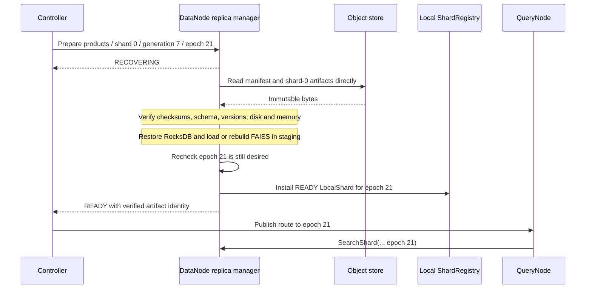

# 0004: Object-store generation bootstrap and replica recovery

- Status: draft
- Date: 2026-09-04

## Intent

Clustered Veclet stores immutable collection-generation artifacts in durable
object storage. When the controller selects a DataNode for a physical replica,
the DataNode fetches the exact logical-shard artifacts directly from S3, GCS,
Azure Blob Storage, or another supported object store. The controller never
proxies vector data.

Object storage makes an immutable generation portable across DataNodes and
cloud clusters. It does not make the controller highly available and does not,
by itself, preserve writes acknowledged after that generation was published.

## Terms and ownership

- A **source partition**, such as `partition=2026-09-18`, groups ingestion
  input. It is not assigned to a DataNode and is not a query-routing key.
- A **logical shard**, such as `products/shard-0`, is the unit routed and
  replicated by Veclet. One logical shard may contain records from many source
  partitions.
- A **generation** is an immutable, checksummed view of the collection. A new
  source partition is normally published by creating a new generation rather
  than mutating an active one in place.
- A **physical replica** is one locally materialized copy of a generation's
  logical shard on a DataNode.
- A **generation manifest** identifies immutable source and runtime artifacts,
  their checksums, sizes, formats, and compatibility requirements.

The controller owns desired placements and placement epochs. A DataNode replica
manager owns download, verification, local materialization, cancellation, and
readiness reporting. `ShardRegistry` owns only the final in-process mapping from
an exact READY `ShardPlacement` to a `LocalShard`; it never performs network or
object-store I/O.

## Object layout

The manifest is the contract. Prefix names are an operator-facing convention
and must not be parsed to reconstruct missing metadata. One illustrative layout
is:

```text
s3://example-bucket/veclet/products/generations/7/
  manifest.json
  shared/
    ivf-coarse-quantizer.faiss
  source/
    partition=2026-09-18/
      shard=00000/part-00000.parquet
      shard=00000/part-00001.parquet
      shard=00001/part-00000.parquet
  replicas/
    shard=00000/records.checkpoint.tar.zst
    shard=00000/index.faiss
    shard=00001/records.checkpoint.tar.zst
    shard=00001/index.faiss
```

The generation directory is never overwritten after publication. A writer
uploads content under a staging prefix, verifies every object, writes the
manifest last, and atomically publishes the manifest reference in controller
metadata.

`data.faiss.pkl` is not a supported artifact. Python pickle is neither a stable
C++ interchange format nor safe to deserialize from an untrusted source. An IVF
coarse quantizer is a collection-generation artifact shared by compatible
shards and is stored using pinned native FAISS serialization. A shard's full
FAISS index is a separate shard artifact.

Parquet is useful as portable source data, but rebuilding RocksDB and HNSW or
IVF from Parquet on every replacement can be slow for tens or hundreds of
millions of rows. A published generation should therefore normally contain:

1. checksummed Parquet files for portable rebuild and audit;
2. a RocksDB checkpoint for fast restoration of authoritative local records;
3. a prebuilt shard-local FAISS index for fast startup; and
4. shared trained artifacts such as an IVF coarse quantizer where required.

A DataNode may rebuild derived FAISS state from the verified RocksDB checkpoint
when the prebuilt index is absent or incompatible. Rebuilding RocksDB directly
from Parquet is the slower fallback, not the default failover path.

## Manifest contract

The manifest includes at least:

- collection ID, generation ID, logical-shard count, and creation identifier;
- vector dimension, metric, canonical float32 encoding, and record schema;
- index type and parameters, pinned FAISS format/version, and required CPU
  capabilities;
- one entry per object with URI, byte size, cryptographic checksum, media type,
  compression, and logical shard or shared scope;
- total uncompressed disk and expected memory requirements per shard;
- RocksDB schema version and checkpoint format; and
- publication completeness and optional source-partition lineage.

The manifest contains object URIs, never static access keys or bearer tokens.
It is bounded in size and validated before any artifact is downloaded.

## Placement preparation and activation

The future controller-to-DataNode control stream sends a **prepare placement**
intent containing the exact `ShardPlacement` and a generation-manifest URI.
This is not `ShardRegistry::Install` and is not a public client RPC.
The complete controller and DataNode lifecycle, including READY reporting,
retry ownership, replacement, and drain, is specified in
[Design 0005](0005-shard-placement-lifecycle.md).



The state transitions are:

| Current state | Event | Durable/local effect | Next state |
| --- | --- | --- | --- |
| absent | prepare current placement | create placement-scoped staging directory | recovering |
| recovering | every object verifies | flush and atomically rename staging data into its immutable local cache key | prepared |
| prepared | local shard opens and placement is still current | install the READY `LocalShard` in `ShardRegistry` | ready |
| recovering or prepared | newer epoch or remove arrives | cancel work; never install the stale placement | absent or recovering newer epoch |
| ready | newer replacement becomes desired | stop admitting new work and drain bounded in-flight work | draining |
| draining | safe removal confirmed | exact registry remove; release or retain immutable cache | absent |
| any non-ready state | verification, capacity, or compatibility failure | keep the prior READY placement, if any; report failure | failed |

Only `ready` is routable. A slow download for epoch 20 cannot activate after
epoch 21 becomes desired. Object-store retries use the original end-to-end
preparation deadline, bounded exponential backoff, and byte/rate limits.
Preparing a replacement does not revoke the currently READY placement. The
registry replacement revokes the old handle only when the new `LocalShard` is
ready, and the controller still waits for collection-level generation safety
before publishing a generation-wide routing change.

## Local materialization and crash recovery

Artifacts download into a placement-scoped staging directory on the same
filesystem as the final replica. Files are written with restrictive
permissions, checksummed while streaming, flushed, and renamed only after the
complete shard validates. A partial download or process crash leaves no
routable registry entry. On restart, incomplete staging state is either resumed
from verified chunks or discarded; an already verified immutable cache may be
reused by checksum.

Installing the local registry entry is the last DataNode-local activation step.
Reporting READY to the controller happens after installation. If READY is lost,
the DataNode reports the same verified artifact identity again. The controller
publishes routing idempotently and only for the currently desired placement.

### First implementation slice

The initial C++ slice deliberately implements only the DataNode-local recovery
boundary. It accepts an already parsed `ShardArtifactManifest`, supports direct
files under `rocksdb/` from a configured filesystem source root, enforces
bounded file counts and byte sizes, and verifies lowercase SHA-256 digests using
the pinned OpenSSL dependency. Serialized manifest parsing and signature or
publisher verification remain separate work.

Verified bytes are copied through unique directories under `staging/`, flushed,
and atomically renamed into a manifest-addressed immutable cache. A second
staged copy becomes the writable live RocksDB replica; HNSW is rebuilt from
those authoritative records. The loader constructor has exclusive ownership of
its configured data root and discards staging directories left by a prior
process. Concurrent loads through that one loader use separate staging paths.

`ReplicaManager` owns the local `RECOVERING`, `READY`, and `FAILED` states. It
does no filesystem, RocksDB, or FAISS work while holding its mutex. Before
installation it rechecks that the operation is still desired; a newer epoch,
exact removal, or caller cancellation fences the attempt. A replacement failure
leaves any prior READY placement active. The adapter performs no hidden retry;
the future control-stream caller owns the end-to-end deadline and controller
retry policy.

## Failure scenarios

### DataNode or instance loss

If one DataNode becomes unavailable, the controller selects an eligible
replacement with a newer placement epoch. The replacement fetches the same
immutable logical-shard generation directly from object storage and remains
outside routing until READY. Surviving READY replicas continue serving if the
collection's availability policy permits it.

### Controller loss

Existing QueryNodes continue using their last-known-good routing snapshot and
existing DataNodes continue serving exact READY placements. No component may
invent a new placement epoch while the controller is unavailable. After the
controller restarts from durable metadata, it reconciles node reports and can
prepare missing replicas from object storage. Object storage shortens data
recovery; it does not replace durable controller metadata or controller HA.

### Object-store loss or throttling

Existing local replicas continue serving. New replicas stay non-routable and
report bounded progress or a terminal error. The controller must not drain the
last safe replica while replacement is blocked. Multi-region artifact copies
or provider replication are deployment choices and must preserve the exact
manifest identity.

### Writes after generation publication

The immutable artifacts restore only the records included in their manifest.
`BatchInsert` records acknowledged afterward are not recoverable from that
generation. Clustered mutable writes therefore require a separate replication
and catch-up design: for example, a verified base generation plus a durable,
bounded delta log or synchronous replica bootstrap barrier.

Until that design is accepted and implemented, Veclet may claim fast recovery
from object storage only for immutable imported generations. Standalone local
writes retain the durability of their local disk, and the existence of
`BatchInsert` must not be presented as instance-loss-safe clustered durability.

## Configuration

Users configure one provider-neutral artifact-store reference and workload
identity; collection placement commands carry only manifest URIs:

```yaml
artifact_store:
  uri: s3://example-bucket/veclet
  auth: workload_identity
  download_concurrency: 4
  max_download_mib_per_second: 250

recovery:
  staging_free_space_percent: 20
  timeout: 20m
```

Equivalent GCS, Azure Blob Storage, and approved filesystem roots use the same
manifest and state machine. Their exact URI syntax belongs to the future
artifact-store adapter contract. Provider-specific endpoint, region,
private-link, and customer-managed encryption-key settings stay in deployment
configuration rather than protobuf collection metadata.

## Security and observability

DataNodes use short-lived workload identity scoped to read only the configured
artifact prefix. Publication credentials are separate. TLS, server-side
encryption, checksum verification, path confinement, decompression limits, and
archive-entry validation are mandatory. A manifest cannot select an arbitrary
local destination path.

Structured logs include collection, generation, logical shard, node, placement
epoch, manifest identity, state transition, byte count, elapsed time, and error
category. Metrics expose recovery counts, bytes, duration, retry count, cache
hits, and failures. Collection IDs, object keys, and manifest URIs remain log
fields or trace attributes, not unbounded metric labels; credentials are never
logged.

## Non-goals

This design does not define controller consensus or HA, mutable-write
replication, cross-region consistency, a public object-store API, query routing
by source partition, provider SDK selection, or the implementation protobuf for
the future control stream.

## Acceptance criteria

- The controller sends only placement intent and immutable manifest identity;
  it never proxies artifact bytes.
- A DataNode downloads only the shared and logical-shard objects named by a
  valid bounded manifest.
- Corrupt, incomplete, incompatible, oversized, cancelled, or stale recovery
  work never enters `ShardRegistry` or routing.
- Restart can reuse a fully verified cache and safely handle partial staging
  state without sleeps or unbounded retry.
- A newer placement epoch fences an older concurrent recovery before local
  installation and before READY reporting.
- Integration tests cover direct object-store recovery, DataNode loss,
  controller restart reconciliation, stale recovery, checksum failure, and
  unavailable object storage.
- Recovery benchmarks state source size, restored bytes, cache state, network
  bandwidth, index type, and time to READY; they do not promise a universal
  recovery time from record count alone.
