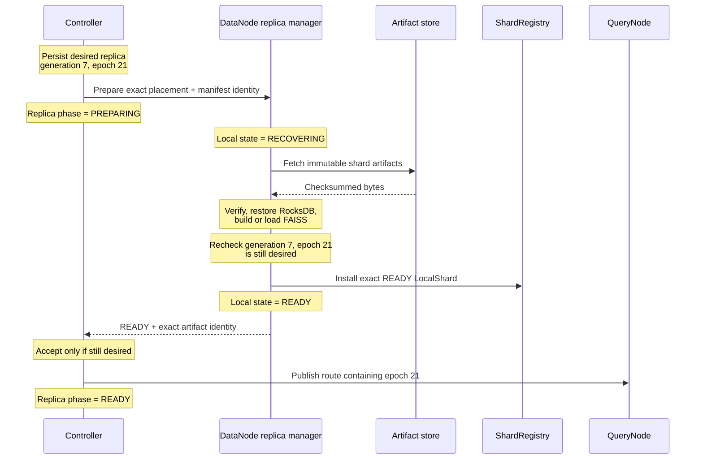

# 0005: Shard placement lifecycle and recovery

- Status: draft
- Date: 2026-09-04

## Intent

This design defines how one physical shard replica moves from a controller
decision to a routable `LocalShard`, how it is replaced or removed, and who
recovers each failure. It distinguishes controller progress from DataNode-local
state so that `IN_PROGRESS` does not hide materially different work.

A placement does not become READY merely because the controller selected a
node. READY means that exact node has verified the immutable generation,
opened RocksDB, built or loaded FAISS, installed the exact placement in its
local registry, and reported that result to the controller. Only then may the
controller include it in routing.

## Terms and owners

A desired physical replica is identified by:

```text
(collection_id, logical_shard_id, generation_id, data_node_id,
 placement_epoch, manifest_id)
```

- The **controller** is the only authority that creates desired replicas,
  selects DataNodes, and advances placement epochs. It persists the desired
  state and publishes query routes.
- The DataNode **replica manager** owns one local attempt to prepare the exact
  desired replica. It may download, verify, restore, and rebuild outside the
  shard-registry lock.
- The DataNode **ShardRegistry** contains only exact READY placements. It is an
  in-memory serving table, not the source of controller truth or vector data.
- A **preparation attempt** is one cancellable execution of a desired
  placement. `SUPERSEDED` describes the outcome of an old attempt; it is not a
  stable replica state.

The controller and DataNode intentionally expose different state machines.
`PREPARING` is distributed control-plane progress. `RECOVERING` is the local
DataNode work within that phase.

## Normal lifecycle



The controller-visible phases are:

| Phase | Meaning | Routable? |
| --- | --- | --- |
| `PLANNED` | The node and epoch are durably selected, but no attempt is known to be running. | No |
| `PREPARING` | The controller has sent or will retry the exact prepare intent; the DataNode may be downloading or rebuilding. | No |
| `READY` | The exact placement and artifact identity were confirmed installed on the selected DataNode. | Yes |
| `DRAINING` | The controller removed the replica from new routing and is waiting for bounded in-flight work before exact removal. | No new traffic |
| `REMOVED` | Exact removal was confirmed, or node loss made the local copy unreachable. | No |
| `FAILED` | Preparation cannot currently reach READY; the failure includes a retry category. | No |

The DataNode-local states are deliberately smaller:

| State | Meaning |
| --- | --- |
| `ABSENT` | No preparation is current and no exact READY placement is installed. |
| `RECOVERING` | One current attempt is verifying or materializing the desired replica. |
| `READY` | The exact placement is installed in `ShardRegistry`. |
| `FAILED` | The current attempt stopped before activation; a prior READY placement may still be serving. |

An old active placement and a newer desired placement may coexist while the
replacement is recovering:

```text
desired: generation 8, epoch 21, state FAILED or RECOVERING
active:  generation 7, epoch 20, state READY
route:   generation 7, epoch 20 only
```

This is expected. A failed replacement must not take a healthy prior replica
out of service.

## DataNode transition model

| Current local state | Event and precondition | Local effect | Result |
| --- | --- | --- | --- |
| `ABSENT` | valid prepare for the current epoch | create a cancellable attempt; begin bounded recovery | `RECOVERING` |
| `RECOVERING` | artifact verifies and local shard opens | recheck desired epoch; atomically install in `ShardRegistry` | `READY` |
| `RECOVERING` | deterministic validation, checksum, compatibility, or local-open failure | discard staging; retain any prior READY placement; report category | `FAILED` |
| `RECOVERING` | deadline or caller cancellation | stop at the next bounded cancellation point; clean staging | `FAILED`, retryable |
| `RECOVERING` | newer epoch becomes desired | cancel old attempt; prevent its installation; start newer attempt | old attempt `SUPERSEDED`; newer `RECOVERING` |
| `RECOVERING` | exact remove becomes desired | cancel and forget the exact attempt | `ABSENT` unless an older active placement remains |
| `FAILED` | exact prepare is retried | create a new attempt using any verified immutable cache | `RECOVERING` |
| `READY` | same generation and manifest receive a newer epoch | re-fence the existing `LocalShard` without artifact reload | `READY` at newer epoch |
| `READY` | replacement generation is prepared successfully | install replacement atomically; revoke prior local handle | `READY` at newer generation and epoch |
| `READY` | exact remove after controller drain | revoke the registry handle; release writable local state | `ABSENT` |
| any | stale prepare or stale remove | reject prepare or ignore remove; preserve current state | unchanged |

The slow attempt never holds the replica-manager or shard-registry lock while
performing filesystem, object-store, RocksDB, or FAISS work. Installation is a
short fenced operation after all preparation succeeds.

## Controller transition model

| Current phase | Event | Controller action | Next phase |
| --- | --- | --- | --- |
| none | placement plan committed | allocate a fresh epoch and persist exact desired identity | `PLANNED` |
| `PLANNED` | eligible node connected | send prepare with one end-to-end deadline | `PREPARING` |
| `PREPARING` | matching READY report | verify node, epoch, generation, and manifest are still desired; publish route | `READY` |
| `PREPARING` | retryable failure or lost response | retry the exact idempotent intent with bounded backoff, or choose another node with a fresh epoch | `PREPARING` or new `PLANNED` |
| `PREPARING` | permanent artifact or compatibility failure | keep it unrouted; require corrected configuration or a newly published immutable generation | `FAILED` |
| `READY` | rebalance, replacement, scale-in, or generation change | first prepare enough replacement replicas to preserve policy | remains `READY` while replacement prepares |
| `READY` | replacements are READY and route update is acknowledged | remove old replica from new routes | `DRAINING` |
| `DRAINING` | bounded in-flight work completed | send exact remove and retain or garbage-collect cache by policy | `REMOVED` |
| any non-removed phase | newer plan supersedes it | persist a fresh epoch; ignore delayed reports for the old identity | new `PLANNED` |

The required replication factor is a precondition for planned drain or
scale-in. Forced failure of an unreachable node is different: the controller
removes the dead route and reports reduced availability until replacement
replicas become READY.

## Failure and recovery matrix

| Failure window | Observable result | Recovery owner and action |
| --- | --- | --- |
| prepare intent is lost or duplicated | no READY report, or an idempotent repeated attempt | controller retries the exact desired intent within a bounded policy |
| source is unavailable or throttled | attempt deadline or retryable source failure; prior READY remains | DataNode performs only bounded intra-attempt retries; controller schedules the next attempt or another node |
| disk or memory capacity is insufficient | explicit resource failure; no registry install | controller chooses a suitable node or operator changes capacity; retry may reuse verified cache |
| size or SHA-256 check fails | corrupt artifact is never activated | publisher repairs by publishing a new immutable generation or manifest identity; do not overwrite the old generation |
| schema, RocksDB, FAISS, CPU, or version is incompatible | permanent compatibility failure; no route | deploy compatible software or publish compatible artifacts |
| process stops during download or cache publication | incomplete staging is not routable | restart discards incomplete staging and retries; a fully verified, atomically renamed cache is reusable |
| process stops after cache publication but before local install | cache exists but registry is empty after restart | controller reconciles and repeats prepare; DataNode reuses the verified cache |
| process stops after local install but before READY report | controller still considers it non-ready | after restart, repeat prepare and reopen local state; without restart, resend READY during stream reconciliation |
| READY report is delayed after a newer epoch is planned | stale report arrives | controller rejects it because every identity field must match current desired state |
| controller stops after accepting READY but before route publication | replica is locally READY but receives no traffic | controller restores desired state, reconciles reports, and publishes routing idempotently |
| route update reaches only some QueryNodes | different QueryNodes temporarily use different valid routing snapshots | each snapshot contains only READY replicas; controller retries monotonic publication and keeps old safe replicas during convergence |
| replacement preparation fails | old active replica remains installed and routed | controller retries elsewhere; it must not begin old-replica drain |
| DataNode becomes unreachable while READY | route is unsafe regardless of local disk state | controller removes the unreachable endpoint, reports degraded replication, and prepares a replacement from immutable artifacts |
| exact remove acknowledgement is lost | removal may already have happened | controller repeats exact remove; DataNode removal is idempotent and cannot remove a newer epoch |

## Retry, fencing, and acknowledgement rules

- The controller alone allocates placement epochs. An RPC or DataNode cannot
  promote itself by presenting a larger number.
- Retrying the same placement keeps collection, shard, generation, node,
  epoch, and manifest identity unchanged.
- Choosing another node, changing a generation, or otherwise changing desired
  placement allocates a fresh epoch.
- One controller attempt carries one end-to-end deadline. DataNode and
  object-store work consume that budget; nested retries do not reset it.
- DataNode cancellation is cooperative at bounded I/O and build boundaries.
  A cancellation that loses the final activation race may observe READY; the
  activation is the linearization point.
- READY acknowledgement includes the exact placement and manifest identity.
  The controller accepts it only while that full identity remains desired.
- Only controller phase `READY` can enter a routing snapshot. Silent partial
  routing is forbidden when any required logical shard has no READY replica.

## Durability and restart reconciliation

Future controller desired state and phase transitions through `PLANNED` must be
durable before commands or routes are published. The DataNode registry and
`RECOVERING` state are reconstructable and need not be durable. The immutable
artifact cache and writable local RocksDB replica survive process restart.

On every control-stream connection or reconnect:

1. the controller sends or summarizes its current desired placements;
2. the DataNode reports locally installed exact placements and incomplete or
   failed attempts;
3. both sides discard reports and work that do not match current epochs;
4. the controller repeats missing prepares and exact removals; and
5. routing changes only after matching READY reports.

If the controller cannot restore its durable placement authority, DataNodes
continue serving only last-installed exact placements and QueryNodes may use a
last-known-good route. No component generates an epoch on the controller's
behalf.

## Current implementation boundary

The initial C++ slice is bounded to the DataNode-local `ReplicaManager` states
and fencing. Its contract accepts an already parsed typed manifest, uses a
bounded filesystem artifact adapter, verifies SHA-256, atomically publishes
local cache and live directories, reconstructs HNSW from authoritative RocksDB,
and installs only a still-current placement. Newer prepare, exact remove, and
caller cancellation stop old work. A failed replacement retains any prior
READY placement.

This slice does not implement the controller, its durable phases, the control
stream, READY reports, route publication, cloud-provider clients, serialized
manifest parsing, artifact publishing, or distributed replication. Those
unimplemented boundaries must not be inferred from the local status API.

## Observability

Every transition log or trace includes collection, shard, generation, node,
placement epoch, manifest identity, old state, new state, duration, and failure
category. These identifiers are structured fields, not metric labels.

Metrics use bounded labels such as state, result, failure category, and source
provider. Useful metrics include current replicas by state, preparation
attempts, bytes, cache hits, duration, cancellations, superseded attempts,
READY acknowledgement latency, and drain duration. Credentials, object paths,
collection IDs, request IDs, and manifest identities are never metric labels.

## Non-goals

This design does not choose a controller consensus implementation, define the
control-stream protobuf, provide mutable-write replication, define cache
garbage collection, or allow source partitions to become routing units.

## Acceptance criteria

- Controller and DataNode states, owners, durable boundaries, and
  linearization points are explicit.
- No state other than controller-confirmed `READY` enters routing.
- Failure before activation leaves the prior READY placement unchanged.
- Delayed work, reports, and removes cannot mutate a newer epoch.
- Every failure class has an explicit retry or operator recovery owner.
- Crash before READY is recoverable from immutable cache or source artifacts.
- Planned drain preserves replication factor and stops new routing before exact
  local removal.
- Deterministic tests cover success, invalid intent, failure with prior active
  state, caller cancellation, superseding epoch, restart staging cleanup, and
  exact removal.
